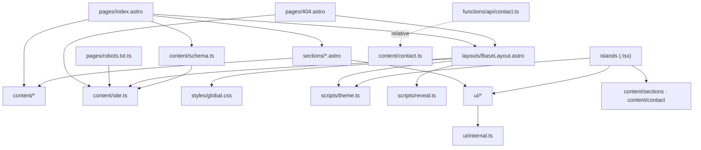
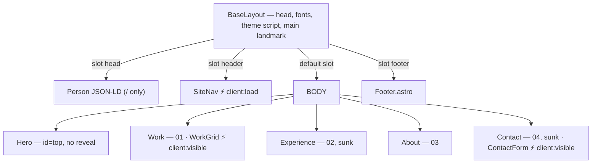
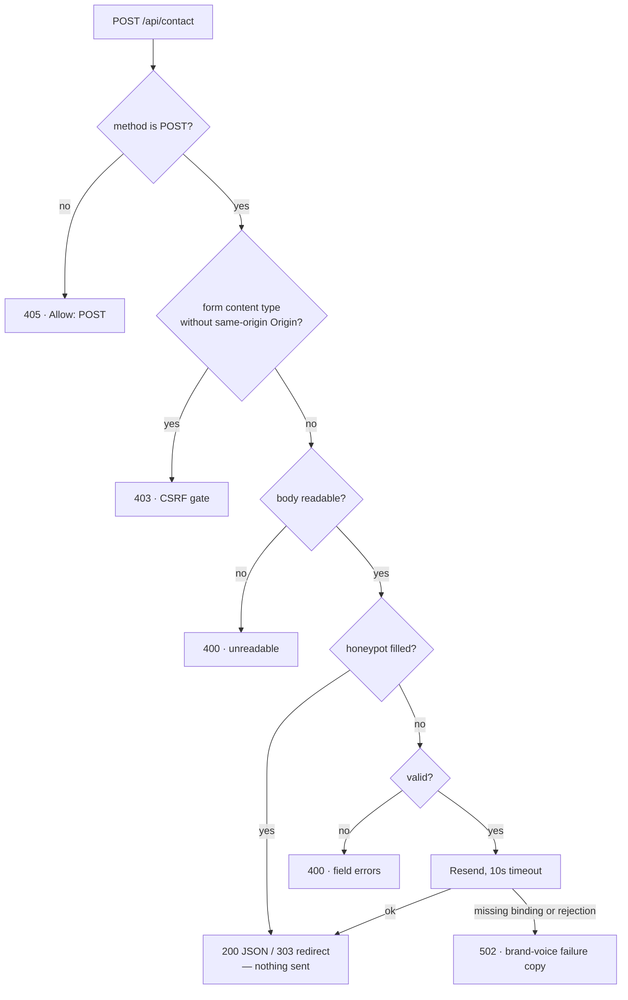

# Architecture — nicolasmateo.dev

How the site is put together: the layers, what hydrates, how a contact submission
travels, and the order the stylesheet is assembled in. Rules are stated as rules in
[`AGENTS.md`](../AGENTS.md); the reasoning behind any single line usually lives in the
comment above that line, and this file points rather than paraphrases.

## What the build produces

| Route               | Rendering            | JavaScript                    |
| ------------------- | -------------------- | ----------------------------- |
| `/`                 | static HTML          | three islands, ~65 KB gzip    |
| `/kit`              | static HTML, noindex | one island (the theme toggle) |
| `/404`              | static HTML          | none of its own               |
| `/robots.txt`       | static endpoint      | —                             |
| `/sitemap-*.xml`    | integration          | —                             |
| `POST /api/contact` | Pages Function       | server-side only              |

Everything but the last is a file in `dist/`. There is no adapter and no SSR — see
[decisions](decisions.md).

## Layers

The **allowed dependency order**. A module may import from its own column or any column
to its right, never to the left:


`functions/` sits outside `src/` as the delivery layer. It may import `src/content`
contract modules by **relative** path — the Pages bundler resolves no aliases — and
nothing else from `src/`. Nothing in `src/` ever imports from `functions/`.

The **actual import graph** is sparser than the order allows, and the difference matters
when reading the code:



The four arrows into `content/site.ts` are every consumer of the origin, which is the whole
of that rule. `/kit` and its specimens are left out: it is a development route, and it imports
the same way `index.astro` does.

Two edges that do **not** exist, and are load-bearing by their absence: `ui → content`
(the kit knows no data) and `scripts → styles` (`scripts/` are import-free leaves).

## The page

`BaseLayout` owns `<head>`, the skip link and `<main id="main" tabindex="-1">`; pages fill
the named slots. A page cannot ship without a main landmark because both ends of that
contract live in one file.



Every block is a `Section.astro`: the anchor, the surface, the 1080px column and the
reveal hook. It renders no header of its own — each numbered section writes its own
`SectionIntro` at whatever its layout opens with (Work and Experience as the shell's first
child, About and Contact inside their first grid column), and that component is the one
place an ordinal is derived, from manifest position, never stored.

## Islands

Three, and only three. An island cannot hydrate inside another, so anything nested is
plain React.

| Island        | Directive        | Owns                                                                                  | May import                                      |
| ------------- | ---------------- | ------------------------------------------------------------------------------------- | ----------------------------------------------- |
| `SiteNav`     | `client:load`    | scroll-spy only; hosts the theme toggle, résumé action and mobile menu as plain React | `@/ui`, `@/content/sections`, `@/scripts/theme` |
| `WorkGrid`    | `client:visible` | the project cards and the drawer, portaled to `document.body`                         | `@/ui`, `@/content/sections`                    |
| `ContactForm` | `client:visible` | submission, inline errors, the no-JS success flag                                     | `@/ui`, `@/content/contact`                     |

**An island may import only import-free content leaves.** Never the `@/content` barrel and
never `@/content/profile`: the barrel re-exports the whole résumé. Anything an island needs
from `profile` crosses as a serialized prop from the `.astro` layer. `e2e/smoke.spec.ts`
walks the page's transitive `/_astro/*.js` graph and fails if a profile-only string appears
in it — the guarantee is structural, not a matter of tree-shaking.

The drawer is portaled because `.reveal` puts a `transform` on `.section__inner`, which
would otherwise become the containing block for its `position: fixed` scrim and panel.

## Content model

Data only — no React, no styling, no imports from `src/ui`. Field names mirror the kit's
frozen prop contracts exactly, so a section spreads content straight into a component with
no mapping layer.

| Module        | Holds                                              | Door                   |
| ------------- | -------------------------------------------------- | ---------------------- |
| `types.ts`    | the shapes `Profile` composes                      | barrel                 |
| `profile.ts`  | the résumé — the only module that must not hydrate | barrel                 |
| `sections.ts` | `SECTIONS` manifest + `COPY`; imports nothing      | barrel **and** subpath |
| `contact.ts`  | the submission contract, shared with the endpoint  | subpath only           |
| `schema.ts`   | the Person JSON-LD, derived from `profile`         | subpath only           |
| `site.ts`     | `requireSite()` — the origin's one narrowing       | subpath only           |

`astro.config.mjs`'s `site` is the single owner of the origin: canonical, every `og:*` URL,
the JSON-LD `url`, the sitemap and `robots.txt` all derive from it. Astro types it optional,
so all four consumers narrow through `requireSite()`.

## The contact endpoint

One route, one file: `functions/api/contact.ts`. Gates answer with a status and no body —
nothing on the page can reach them. The pipeline answers with JSON the island renders.



One parsed media type decides both the gate and how the body is read, so they cannot
disagree. `application/json` is exempt from the origin check — a plain form cannot forge it —
and the no-JS path is unaffected, because browsers send `Origin` on same-origin form posts.
**Nothing here ever logs a message body or a submitter address.**

## Stylesheet

`global.css` is the entry point and assembles four layers in this order. The order is
load-bearing: `global.css` loads last, so at equal specificity its rules beat `sections.css`.

| #   | Layer             | Holds                                                         | Editable |
| --- | ----------------- | ------------------------------------------------------------- | -------- |
| 1   | `tokens/*.css`    | the design vocabulary; `base.css` last, it consumes the rest  | **no**   |
| 2   | `sections.css`    | page layout, one class block per page block                   | yes      |
| 3   | the site layer    | font stacks, `--nav-h`, utilities, nav chrome, the breakpoint | yes      |
| 4   | theme corrections | `:root:not([data-theme="dark"])` then `[data-theme="dark"]`   | yes      |

A correction never goes in `tokens/`, and never in a bare `:root` — that out-orders
`colors.css`'s dark block and silently breaks the dark theme.

**There is exactly one breakpoint, `width < 900px`.** It is set by readability, not by the
header: the bar fits on one line down to 691px, while 900 is where the hero copy column falls
under ~41ch and a project card under 392px. The full arithmetic, measured against a real
build, is in the comment above the media query in `global.css` — that is its only home.

Where the kit writes a property inline, the lever is a **custom property**, never
`!important` and never a fork: either one the kit already reads (`--section-y`, `--gutter`)
or one the call site injects with the kit's own value as the fallback (`--rail-cols`,
`--rail-gap`). The fallback is mandatory — an undefined `var()` is invalid at computed-value
time and would collapse the grid.

## Build output

```
dist/
  index.html  kit/index.html  404.html    static pages
  robots.txt  sitemap-index.xml  sitemap-0.xml
  _astro/*.js  *.css                       hashed, immutable-cached
  _headers                                 from public/, consumed by Pages
  og.png  favicon.svg  resume-*.pdf
```

`public/_headers` owns response headers; the sitemap excludes `/kit`, which also carries
`noindex` — [`astro.config.mjs`](../astro.config.mjs) and the page's `noindex` prop must
agree. See [operations](operations.md) for what happens to `dist/` after that.
