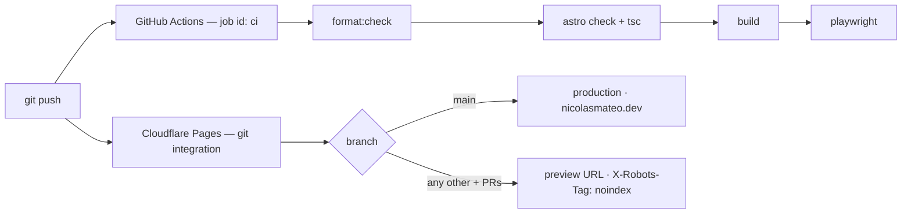

# Operations — nicolasmateo.dev

Environment, delivery, budgets and the release runbook. GitHub Actions owns quality,
Cloudflare owns delivery, and **Actions never deploys**.

## Environment

Three keys, all consumed by `functions/api/contact.ts` — the only code in the repo that
reads the environment. Secrets are credentials; vars are configuration.

| Key              | Type in Pages | Production | Preview   | Local       |
| ---------------- | ------------- | ---------- | --------- | ----------- |
| `EMAIL_FROM`     | variable      | dashboard  | dashboard | `.dev.vars` |
| `EMAIL_TO`       | variable      | dashboard  | dashboard | `.dev.vars` |
| `RESEND_API_KEY` | **secret**    | live key   | test key  | `.dev.vars` |

Every key is set twice in the dashboard — once for Production, once for Preview
(Settings → Variables and Secrets). Per-environment values are why this project is on Pages.

- **Access is `context.env`**, the Function's first argument, typed by a three-key
  `interface Env` colocated in the file. Nothing imports the environment from a module.
- **A missing binding is caught; a wrong one is not.** `send()` returns early if any of the
  three is absent, logging that fact and naming no value, so the endpoint answers `502` with
  the brand-voice failure copy rather than an opaque Resend rejection. It cannot tell a
  typo'd address from a correct one.
- **Never log message bodies or submitter emails.** Status codes and outcomes only.
- `EMAIL_FROM` reaches Resend verbatim, so `user@domain` and `Name <user@domain>` both work.
  It must stay on the verified domain — Resend cannot send from the Gmail address.
- `EMAIL_TO` mirrors `profile.email` in `src/content/profile.ts`. The value lives only in the
  dashboard, so **nothing in the repo can flag that drift**: editing `profile.email` means
  editing both Pages environments too.

### Local

Create `.dev.vars` in the repo root (gitignored) with all three keys, quoting `EMAIL_FROM` —
the display-name form contains spaces and angle brackets. `npm run preview` reads it;
`npm run dev` does not, because `astro dev` does not serve the endpoint at all.

`npm run preview` is `wrangler pages dev`, serving the built `dist/` plus `functions/` from
workerd at `localhost:8788`. It watches `functions/` and its relative imports, so Function
edits hot-reload; only static HTML changes need a rebuild.

- **The port is pinned** because `playwright.config.ts` hardcodes `localhost:8788`. The two
  move together.
- **The compatibility date** (`--compatibility-date` in the `preview` script) must match what
  both dashboard environments are set to. It selects runtime behaviour, so it must also be a
  date the installed workerd supports — it does not need to equal that release's date, and
  they currently differ.
- Do not leave a stale `.wrangler/deploy/config.json` around: `wrangler pages dev` resolves
  config through that redirect and **throws** if its target is missing rather than falling
  back.

## Delivery

Actions is the quality gate and publishes nothing. Pages builds and publishes from the repo:
project `portfolio-web`, `main` → production, every other branch and PR → its own preview URL
with its own vars and secrets. The job id `ci` is referenced by branch protection as a
required check — do not rename it.

### Pages configuration

**There is no wrangler config file, by decision** ([decisions](decisions.md)). All of it is
dashboard-managed, per environment:

| Setting            | Value                                  |
| ------------------ | -------------------------------------- |
| Build command      | `npm run build`                        |
| Output directory   | `dist`                                 |
| Production branch  | `main`                                 |
| Compatibility date | must match the `preview` script's flag |
| Variables, secrets | per environment, per the table above   |

`sharp` is a **direct** dependency, not just astro's optional one: the static image service
emits a chunk that does a bare `import("sharp")`. The build no longer proves this — npm's
flat layout hoists it either way — so check the declaration (`npm ls sharp`), not the build.

### Headers and caching

`public/_headers` ships to `dist/_headers` and Pages consumes it natively. Cloudflare applies
every matching rule, so the two blocks compose.

| Path        | Header                                                         | Why                                                                                                |
| ----------- | -------------------------------------------------------------- | -------------------------------------------------------------------------------------------------- |
| `/*`        | `X-Content-Type-Options`, `Referrer-Policy`                    | Pages sends both by default; declared so the posture is the repo's and survives a default changing |
| `/*`        | `Permissions-Policy: camera=(), geolocation=(), microphone=()` | the genuinely new one — the site uses none of them                                                 |
| `/_astro/*` | `Cache-Control: public, max-age=31536000, immutable`           | hashed filenames: the bytes at one of these URLs never change                                      |

## Performance budgets

| Metric               | Budget                        | Measured 2026-08-25 (desktop / mobile) |
| -------------------- | ----------------------------- | -------------------------------------- |
| Performance          | ≥ 95                          | **100 / 100**                          |
| Best Practices · SEO | 100                           | **100 / 100**                          |
| Accessibility        | 100 net of one exemption      | **96 / 96** — see below                |
| LCP                  | ≤ 2.0s desktop, ≤ 2.5s mobile | 0.4s / 1.7s                            |
| CLS                  | ≤ 0.05                        | 0.036 / 0.034                          |
| JS shipped           | ≤ 90 KB gzip                  | 64.6 KB (66,135 B)                     |

Measured with `npx lighthouse` against `npm run preview` on Playwright's chromium. Preview
deployments send `X-Robots-Tag: noindex`, which fails the SEO category — run
Performance/Accessibility/Best-Practices against a preview and SEO against production.

**Accessibility 96 is one audit and a locked design decision, not a defect**: `color-contrast`
on the hero's accent CTA, which is `--clay`'s defined value. `e2e/a11y.spec.ts` carries it as a
narrow documented exemption, so the repo's own axe suite passes at zero violations; Lighthouse
has no way to be told. The measurement and the reasoning are in
[brand](brand.md#known-contrast-exception); **a score below 96 is a real regression** — the
exemption covers exactly one colour pair, not the category.

## Release runbook

1. `npm run format` · `npm run check` · `npm run test:e2e` locally.
2. Push the branch. CI green, and the preview deployment gets its own URL.
3. Smoke the preview: both themes, the reveal, both résumé downloads, a real contact send.
4. PR `dev → main`, merged with a **merge commit — never squash**.
5. Production smoke on `https://nicolasmateo.dev`: both themes, reveal, both résumés, one real
   contact send received, `/404`, `robots.txt` and the sitemap fetchable, and the OG card
   rendering in a link-preview validator.
6. If anything about the environment changed, re-check both Pages environments — production and
   preview carry separate copies of all three keys.

## Deliberately not built

Analytics — nothing third-party was designed in, and adding one is a design decision before it
is a technical one. Blog or case-study pages. Turnstile on the contact form: the honeypot is the
whole spam defence, and Turnstile is the documented next step **only if spam actually appears**.
